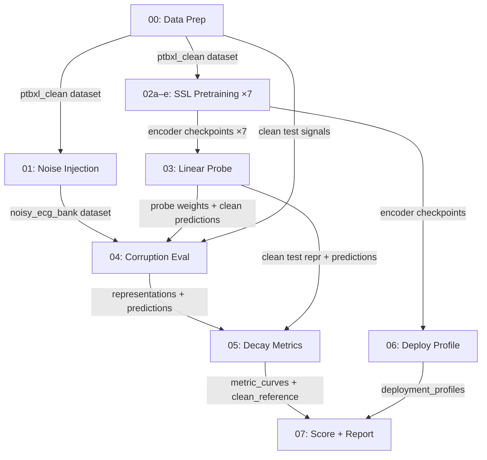

# Representation Decay in Self-Supervised ECG Models Under Graded Noise

End-to-end framework for evaluating how self-supervised ECG encoders degrade under clinically realistic noise corruption and converting those measurements into audited robustness scores with deployment-aware recommendations.

**Dataset**: PTB-XL (21,799 records, 18,869 patients, 12-lead, 500 Hz, 10 s)
**Target**: 5 diagnostic superclasses — NORM · MI · STTC · CD · HYP
**Execution environment**: Kaggle T4 GPU notebooks (16 GB VRAM, <12 h limit)

---

## Repository Structure

```
ECG_SSL_Haqila_Lab/
├── ecg_ssl_utils/               # Reusable utility package (uploaded as Kaggle Dataset)
│   ├── config.py                # Central dataclass configuration for the entire pipeline
│   ├── data/                    # PTB-XL loading, preprocessing, label encoding
│   │   ├── ptbxl_loader.py      #   load_ptbxl(), get_patient_split()
│   │   ├── preprocessing.py     #   bandpass_filter(), compute_norm_stats(), normalize_signals()
│   │   └── label_encoder.py     #   encode_superclass_labels(), SUPERCLASS_NAMES
│   ├── noise/                   # Noise bank construction and injection
│   │   ├── nstdb_loader.py      #   MIT-BIH NSTDB loading (BW, MA, EM)
│   │   ├── synthetic_noise.py   #   Powerline, electrode pop, inverter switching generators
│   │   ├── injection.py         #   inject_noise(), compute_snr() — SNR-scaled deterministic
│   │   └── noise_spec.py        #   Noise type specifications
│   ├── models/                  # Encoder architectures
│   │   ├── vit_small_1d.py      #   ViT-Small 1D (12L, 384d, 6H, patch 50, ~22M params)
│   │   ├── resnet18_1d.py       #   ResNet-18 1D (CNN backbone control)
│   │   └── projectors.py        #   MLPProjector, BYOLProjector, MLPPredictor, SwAVPrototypes
│   ├── ssl/                     # Self-supervised training paradigms
│   │   ├── simclr.py            #   SimCLRTrainer (NT-Xent contrastive)
│   │   ├── clocs.py             #   CLOCSTrainer (temporal + spatial + patient contrastive)
│   │   ├── mae.py               #   MAEModel, MAEDecoder, MAETrainer (masked reconstruction)
│   │   ├── jepa.py              #   JEPAModel, JEPAPredictor, JEPATrainer (latent-predictive)
│   │   ├── byol.py              #   BYOLTrainer (bootstrap your own latent)
│   │   ├── swav.py              #   SwAVTrainer (Sinkhorn prototype assignment)
│   │   └── augmentations.py     #   ECGAugmentation (crop, jitter, scaling, noise, masking)
│   ├── probe/                   # Linear probe training and calibration
│   │   ├── linear_probe.py      #   train_probe(), LinearProbe
│   │   └── calibration.py       #   temperature_scaling()
│   ├── eval/                    # Evaluation metrics
│   │   ├── auroc.py             #   macro_auroc(), subgroup_auroc()
│   │   ├── f1.py                #   per_class_f1()
│   │   ├── ece.py               #   expected_calibration_error() — one-vs-rest, 15 bins
│   │   ├── cka.py               #   linear_cka()
│   │   ├── effective_rank.py    #   effective_rank() — spectral entropy
│   │   ├── delong.py            #   delong_test() — paired AUROC comparison
│   │   └── bootstrap.py         #   patient_bootstrap_ci() — 1000 resamples
│   ├── score/                   # Robustness scoring and decision support
│   │   ├── robustness_score.py  #   compute_robustness_score() — weighted 4-component fusion
│   │   ├── gates.py             #   check_robustness_gates() — non-compensatory AUROC/ECE gates
│   │   ├── normalization.py     #   reference_anchored_normalize() — min-max to [0,1]
│   │   ├── sobol.py             #   sobol_sensitivity() — Dirichlet-sampled weight perturbation
│   │   ├── decision_support.py  #   DecisionSupportEngine — constraint-filtered recommendations
│   │   └── radar.py             #   Radar chart generation
│   ├── deploy/                  # ONNX export and hardware profiling
│   │   ├── onnx_export.py       #   export_to_onnx()
│   │   ├── quantization.py      #   quantize_model() — dynamic, static, selective INT8
│   │   └── profiler.py          #   profile_model() — latency, memory, throughput, energy
│   └── report/                  # Report artifact generation
│       ├── leaderboard.py       #   generate_leaderboard() — HTML table
│       ├── decay_curves.py      #   plot_decay_curves() — AUROC-vs-SNR plots
│       ├── risk_report.py       #   generate_risk_report() — per-noise heatmaps (R3)
│       ├── config_guidelines.py #   generate_config_guidelines() — deployment rules (R2)
│       ├── flowchart.py         #   generate_decision_flowchart()
│       └── model_card.py        #   Model card generation
├── scripts/                     # Pipeline execution scripts (00–07)
│   ├── 00_data_preparation.py
│   ├── 01_noise_injection.py
│   ├── 02a_pretrain_simclr.py
│   ├── 02b_pretrain_clocs.py
│   ├── 02c_pretrain_mae.py
│   ├── 02d_pretrain_jepa.py
│   ├── 02e_pretrain_byol_swav.py
│   ├── 03_linear_probe.py
│   ├── 04_corruption_eval.py
│   ├── 05_decay_metrics.py
│   ├── 06_deploy_profile.py
│   └── 07_dss_and_report.py
├── requirements.txt
└── README.md
```

---

## Pipeline Overview

The pipeline is decomposed into **12 standalone Python scripts** mapped to 7 methodology phases. Each script runs as a separate Kaggle notebook. Outputs are saved as Kaggle Datasets or Models and imported as inputs to subsequent scripts.

| # | Script | Methodology Phase | Description | Accelerator |
|---|--------|-------------------|-------------|-------------|
| 00 | `00_data_preparation.py` | I. Data & Preprocessing | Load PTB-XL, bandpass filter, normalize, encode superclass labels, patient-level split | CPU/GPU |
| 01 | `01_noise_injection.py` | I. Noise Protocol | Build noise bank (NSTDB + synthetic), generate injection manifest | CPU |
| 02a | `02a_pretrain_simclr.py` | II. SSL Pretraining | SimCLR — instance-discriminative contrastive | GPU T4 |
| 02b | `02b_pretrain_clocs.py` | II. SSL Pretraining | CLOCS — patient/lead/time-aware contrastive | GPU T4 |
| 02c | `02c_pretrain_mae.py` | II. SSL Pretraining | MAE — masked reconstruction (75% mask) | GPU T4 |
| 02d | `02d_pretrain_jepa.py` | II. SSL Pretraining | JEPA — latent-predictive with EMA target | GPU T4 |
| 02e | `02e_pretrain_byol_swav.py` | II. SSL Pretraining | BYOL + SwAV + CLOCS-ResNet18 (sensitivity arms) | GPU T4 |
| 03 | `03_linear_probe.py` | III. Linear Probe | Frozen encoder → CLS → linear classifier, temperature scaling | GPU T4 |
| 04 | `04_corruption_eval.py` | III. Frozen Evaluation | Inject noise on-the-fly, evaluate frozen encoder + frozen probe | GPU T4 |
| 05 | `05_decay_metrics.py` | III–IV. Metrics & Stats | CKA, ER, ECE, AUROC, F1, DeLong tests, bootstrap CIs, BH correction | CPU |
| 06 | `06_deploy_profile.py` | VI. Deployment Profiling | ONNX export, quantization (FP32/INT8), latency/memory/throughput/energy | CPU |
| 07 | `07_dss_and_report.py` | V + VII. Score & Reports | Robustness Score, Sobol analysis, Decision-Support Engine, all report artifacts | CPU |

### Data Flow



---

## Methodology Phase Details

### I. Data, Labels, Preprocessing and Noise Protocol

**Script 00** loads the PTB-XL dataset, applies preprocessing, and saves clean splits:

- **Preprocessing** (`ecg_ssl_utils/data/preprocessing.py`): 4th-order Butterworth bandpass filter (0.5–45 Hz) to suppress baseline drift and high-frequency noise. Per-lead z-score normalization using training-set statistics.
- **Label construction** (`ecg_ssl_utils/data/label_encoder.py`): SCP-ECG statements mapped to 5 PTB-XL diagnostic superclasses (NORM, MI, STTC, CD, HYP) via `scp_statements.csv`. Multi-label binary encoding.
- **Patient-level split** (`ecg_ssl_utils/data/ptbxl_loader.py`): Folds 1–8 → Train, Fold 9 → Validation, Fold 10 → Test. Follows the canonical PTB-XL protocol.

**Script 01** constructs the noise bank and injection manifest:

- **Empirical noise** (`ecg_ssl_utils/noise/nstdb_loader.py`): MIT-BIH NSTDB records — Baseline Wander (BW), Muscle Artifact (MA), Electrode Motion (EM). 20 templates per type, resampled to 500 Hz, replicated to 12 leads.
- **Synthetic noise** (`ecg_ssl_utils/noise/synthetic_noise.py`): 50 Hz powerline + 3 harmonics, Poisson-process electrode pops, inverter switching at 200 Hz carrier. 20 templates per type.
- **Injection** (`ecg_ssl_utils/noise/injection.py`): Deterministic, on-the-fly. Applied to clean test ECGs only. SNR-scaled: `x_noisy = x + α·n` where α is computed to achieve the target SNR. Keyed by (record, noise type, SNR, seed).
- **Graded corruption grid**: 6 single noise types × 6 SNR levels (−6, 0, 6, 12, 18, 24 dB) × 3 seeds + 3 mixed-noise conditions × 6 SNR × 3 seeds = **162 corruption conditions per encoder**.

The manifest is saved as a Parquet file mapping every (record, noise_type, SNR, seed) tuple. No pre-materialized noisy arrays are stored.

---

### II. Self-Supervised Pretraining — Shared Backbone

**Scripts 02a–02e** pretrain 7 SSL encoders under budget parity.

**Shared backbone** (`ecg_ssl_utils/models/vit_small_1d.py`): ViT-Small 1D — 12 layers, 384-d, 6 heads, patch size 50 (= 100 tokens + 1 CLS = 101 tokens), ~22M parameters.

**Shared training budget** (`ecg_ssl_utils/config.py → SSLTrainingConfig`):
- 200 epochs, AdamW, batch 256, gradient accumulation ×4 (effective batch 1024)
- Linear warmup (10 epochs) → cosine annealing to 1e-6
- AMP (mixed precision), gradient clipping (norm 1.0)
- Checkpoints every 20 epochs with automatic resume

| Encoder | Script | Paradigm | Status |
|---------|--------|----------|--------|
| SimCLR | `02a` | Instance-discriminative contrastive (NT-Xent, τ=0.5) | Primary |
| CLOCS | `02b` | Temporal + spatial + patient contrastive (batch 128 for memory) | Primary |
| MAE | `02c` | Masked reconstruction (75% mask ratio, LR 1.5e-3, warmup 20 epochs) | Primary |
| JEPA | `02d` | Latent-predictive with EMA target encoder (momentum 0.996→1.0) | Primary |
| BYOL | `02e` | Bootstrap latent prediction (EMA momentum 0.996→1.0) | Sensitivity |
| SwAV | `02e` | Sinkhorn prototype assignment (256 prototypes, τ=0.1) | Sensitivity |
| CLOCS-ResNet18 | `02e` | CLOCS with ResNet-18 1D backbone instead of ViT-S | Sensitivity |

**Stability safeguards** (applied to all contrastive methods): Collapse early-stopping monitors embedding standard deviation and average cosine similarity every 10 epochs. Training halts after 5 consecutive collapse detections (std < 1e-4 or cos_sim > 0.95). Float32-wrapped BatchNorm prevents AMP-induced NaN propagation.

---

### III. Frozen-Encoder Classification and Robustness Evaluation

**Script 03 — Linear Probe Training** (`ecg_ssl_utils/probe/`):
- Frozen SSL encoder → CLS token embedding → single linear layer → 5 superclass outputs
- Trained on clean data only (folds 1–8), validated on fold 9
- 50 epochs, Adam, early stopping on validation macro-AUROC (patience 10)
- Temperature scaling applied post-training using validation logits
- Saves: probe weights, clean test representations, clean test predictions (for paired comparison)

**Script 04 — Frozen Evaluation** (`scripts/04_corruption_eval.py`):
- Encoder weights frozen, probe weights frozen. No retraining or adaptation under corruption.
- For each of the 162 corruption conditions: inject noise on-the-fly → frozen encoder → frozen probe → save (representations, predictions)
- **Integrity verification**: SHA-256 hash of encoder and probe parameters checked before and after each condition to assert no weight mutation
- Representations stored as float16 (space), predictions as float32

**Script 05 — Decay Metrics** (`ecg_ssl_utils/eval/`):

All metrics computed as paired clean-vs-noisy comparisons on the same test records:

| Metric | Module | Description |
|--------|--------|-------------|
| Macro-AUROC | `auroc.py` | One-vs-rest macro-averaged AUROC across 5 superclasses |
| Per-class F1 | `f1.py` | Per-superclass F1 (NORM, MI, STTC, CD, HYP) |
| ECE | `ece.py` | One-vs-rest ECE per superclass, 15 equal-width bins, macro-averaged |
| Linear CKA | `cka.py` | Representation geometry similarity: CKA(clean_repr, noisy_repr) |
| Effective Rank | `effective_rank.py` | Spectral entropy of representation singular values |
| DeLong test | `delong.py` | Per-class paired AUROC comparison (clean vs. noisy), α=0.05 |
| Bootstrap CI | `bootstrap.py` | Patient-level bootstrap, 1000 resamples, 95% CIs |

**Clean reference evaluation** is computed separately per encoder from script 03's saved clean predictions, establishing the baseline for all delta computations.

**DeLong p-values** are per-class, per-condition. Benjamini-Hochberg correction is applied globally across all aggregated conditions after seed-averaging (implemented in script 05, with `statsmodels.stats.multitest` if available, otherwise manual BH fallback).

---

### IV. Statistical Validation of Robustness

Implemented within **Script 05**:

- **Patient-level bootstrap**: 1000 resamples per metric, 95% CIs. Resamples at the patient level (not record level) to preserve within-patient correlation.
- **DeLong test**: Paired clean-vs-noisy AUROC comparison per superclass. Two-sided Z-test with BH-adjusted p-values.
- **Seed variance**: 3 deterministic seeds (42, 123, 456) per corruption condition. Per-seed results saved in `metric_curves_per_seed.parquet`; seed-averaged results in `metric_curves.parquet`.

---

### V. Robustness Score

Implemented in **Script 07** using `ecg_ssl_utils/score/`:

**Score computation** (`robustness_score.py`):
$$\text{Robustness} = \alpha(1 - \Delta CKA_n) + \beta(1 - \Delta ER_n) + \gamma(1 - \Delta ECE_n) + \delta(1 - \Delta AUROC_n)$$

Where deltas are computed relative to clean reference:
- ΔCKA = 1 − CKA(clean, noisy)
- ΔER = 1 − ER(noisy) / ER(clean)
- ΔAUROC = max(0, AUROC_clean − AUROC_noisy)
- ΔECE = max(0, ECE_noisy − ECE_clean)

Default weights: α = β = γ = δ = 0.25 (equal weighting).

All deltas are globally min-max normalized to [0,1] (`normalization.py`) before score computation. This normalization is anchored to the observed experimental grid and is valid for within-experiment ranking only.

**Non-compensatory gates** (`gates.py`):
- AUROC gate: raw AUROC < 0.70 → Robustness Score = 0 (reject)
- ECE gate: raw ECE > 0.15 → Robustness Score = 0 (reject)

**Sobol sensitivity analysis** (`sobol.py`): 1024 weight configurations sampled from a Dirichlet(1,1,1,1) distribution on the 4-simplex. Evaluates ranking stability across weight perturbations. First-order sensitivity indices computed via conditional variance decomposition (10 bins per weight dimension).

---

### VI. Edge Deployment Profiling

**Script 06** (`ecg_ssl_utils/deploy/`):

| Component | Implementation | Details |
|-----------|---------------|---------|
| ONNX export | `onnx_export.py` | Opset 17, FP32 baseline |
| Quantization | `quantization.py` | INT8 dynamic, INT8 static (200 calibration samples), selective (attention FP32 / FFN INT8) |
| Profiling | `profiler.py` | Latency p50/p95, peak memory, throughput, estimated energy |
| Providers | — | CPUExecutionProvider, CUDAExecutionProvider |

Deployment profiling is **independent of robustness evaluation**. Latency and memory are not components of the Robustness Score.

---

### VII. Deployment-Aware Decision Support

**Script 07** implements the Decision-Support Engine (`ecg_ssl_utils/score/decision_support.py`):

The engine combines Robustness Score + Deployment Profile + user-defined constraints:

1. **Robustness gates**: Check AUROC/ECE thresholds (non-compensatory)
2. **Deployment constraints**: Max latency (default 100 ms), max memory (default 512 MB), min robustness (default 0.50)
3. **Sobol stability**: Configurations with stability ≥ 0.90 → RECOMMEND; below → RECOMMEND_QUALIFIED
4. **Ranking**: Feasible configurations ranked by robustness score

**Output artifacts**:
- **R1 — Model Recommendations** (`leaderboard.html`): Ranked feasible model × quantization × hardware configurations
- **R2 — Configuration Guidelines** (`config_guidelines.md`): Rule-derived matching of constraints to best model/quantization/hardware
- **R3 — Per-Noise-Type Risk Reports** (`risk_reports/risk_report.html`): Model × SNR heatmaps for AUROC, ECE, CKA, F1 per noise type, with color-coded severity bands

---

## Kaggle Execution Workflow

### Setup

Upload `ecg_ssl_utils/` as a Kaggle Dataset (e.g., `ecg-ssl-utils`). In each notebook:
```python
import sys
sys.path.insert(0, '/kaggle/input/ecg-ssl-utils/')
from ecg_ssl_utils.config import get_config
```

### Execution Order

```
Session  1:  00_data_preparation.py        → ptbxl-clean-processed
Session  2:  01_noise_injection.py          → noisy-ecg-bank
Sessions 3–7:  02a through 02e (parallel)   → ssl-simclr-vit-small, ssl-clocs-vit-small,
                                               ssl-mae-vit-small, ssl-jepa-vit-small,
                                               ssl-byol-vit-small, ssl-swav-vit-small,
                                               ssl-clocs-resnet18
Session  8:  03_linear_probe.py             → linear-probes-all
Session  9:  04_corruption_eval.py          → corruption-eval-results
Session 10:  05_decay_metrics.py            → decay-metrics-results
Session 11:  06_deploy_profile.py           → deployment-profiles
Session 12:  07_dss_and_report.py           → ecg-ssl-robustness-report
```

Sessions 3–7 can run in parallel across separate notebooks. All other sessions are sequential.

---

## Configuration Reference

All hyperparameters are centralized in `ecg_ssl_utils/config.py` as dataclasses. Key defaults:

| Parameter | Value | Location |
|-----------|-------|----------|
| Sampling rate | 500 Hz | `DataConfig` |
| Signal length | 5000 samples (10 s) | `DataConfig` |
| Bandpass filter | 0.5–45 Hz, 4th-order Butterworth | `DataConfig` |
| Superclasses | NORM, MI, STTC, CD, HYP | `DataConfig` |
| ViT-S patch size | 50 samples | `BackboneConfig` |
| ViT-S architecture | 12L / 384d / 6H / ~22M params | `BackboneConfig` |
| SSL epochs | 200 | `SSLTrainingConfig` |
| SSL batch size | 256 (effective 1024 with grad accum ×4) | `SSLTrainingConfig` |
| SSL optimizer | AdamW, LR 1e-3, WD 1e-4 | `SSLTrainingConfig` |
| Warmup | 10 epochs (linear), then cosine to 1e-6 | `SSLTrainingConfig` |
| SimCLR temperature | 0.5 | `SimCLRConfig` |
| MAE mask ratio | 0.75 | `MAEConfig` |
| JEPA EMA momentum | 0.996 → 1.0 (cosine) | `JEPAConfig` |
| Probe epochs | 50 (early stopping, patience 10) | `ProbeConfig` |
| ECE bins | 15 | `EvalConfig` |
| Bootstrap resamples | 1000 | `EvalConfig` |
| DeLong α | 0.05 | `EvalConfig` |
| SNR grid | −6, 0, 6, 12, 18, 24 dB | `NoiseConfig` |
| Seeds | 42, 123, 456 | `NoiseConfig` |
| AUROC gate | 0.70 | `DSSConfig` |
| ECE gate | 0.15 | `DSSConfig` |
| Sobol samples | 1024 | `DSSConfig` |
| Quantization modes | FP32, INT8 dynamic, INT8 static, selective | `DeployConfig` |

---

## Mathematical Formulas

| Metric | Formula | Reference |
|--------|---------|-----------|
| SNR-scaled injection | $x_{\mathrm{noisy}} = x + \sqrt{P_{\mathrm{target}} / P_{\mathrm{raw}}} \cdot n_{\mathrm{raw}}$ | Signal processing standard |
| NT-Xent (SimCLR) | $-\log \frac{\exp(\mathrm{sim}(z_i, z_j) / \tau)}{\sum_{k} \mathbb{1} \exp(\mathrm{sim}(z_i, z_k) / \tau)}$ | Chen et al., ICML 2020 |
| MAE loss | $\frac{1}{\lVert\mathcal{M}\rVert} \sum_{i \in \mathcal{M}} \lVert x_i - \hat{x}_i \rVert^2$ | He et al., CVPR 2022 |
| JEPA loss | $\frac{1}{\lVert\mathcal{T}\rVert} \sum_{i \in \mathcal{T}} \lVert \hat{s}_{y,i} - \mathrm{sg}(s_{y,i}) \rVert^2$ | Assran et al., CVPR 2023 |
| BYOL loss | $2 - 2 \cdot \frac{\langle q_\theta(z_1), z_2' \rangle}{\lVert q_\theta(z_1)\rVert \cdot \lVert z_2'\rVert}$ | Grill et al., NeurIPS 2020 |
| Linear CKA | $\frac{\lVert Y^\top X\rVert_F^2}{\lVert X^\top X\rVert_F \cdot \lVert Y^\top Y\rVert_F}$ | Kornblith et al., ICML 2019 |
| Effective Rank | $\exp(-\sum \bar{\sigma}_i \ln(\bar{\sigma}_i))$ | Roy & Vetterli, 2007 |
| ECE | $\sum (|B_m|/n) \cdot |acc(B_m) - conf(B_m)|$ | Guo et al., ICML 2017 |
| DeLong Z-stat | $\frac{\hat{\theta}_A - \hat{\theta}_B}{\sqrt{\mathrm{Var}(\hat{\theta}_A) + \mathrm{Var}(\hat{\theta}_B) - 2\mathrm{Cov}(\hat{\theta}_A, \hat{\theta}_B)}}$ | DeLong et al., Biometrics 1988 |
| Robustness Score | $\alpha(1-\Delta CKA_n) + \beta(1-\Delta ER_n) + \gamma(1-\Delta ECE_n) + \delta(1-\Delta AUROC_n)$ | Proposed |

---

## Risk Mitigations

| Risk | Mitigation |
|------|------------|
| Training >12 h (Kaggle limit) | Checkpoints every 20 epochs. All scripts auto-resume from `checkpoint.pt`. |
| VRAM OOM | Default batch 256 with AMP. CLOCS auto-reduces to 128 (6× encoder forward passes). Grad accumulation ×4 for effective batch 1024. |
| Representation collapse | Collapse early-stopping: embedding std and cosine similarity monitored every 10 epochs. Training halts after 5 consecutive detections. |
| Noise bank too large | On-the-fly deterministic injection from manifest. No pre-materialized noisy arrays. |
| Evaluation integrity | SHA-256 parameter hashing before/after each corruption condition. Assertions verify encoder and probe weights are immutable. |
| DeLong multiple comparisons | Benjamini-Hochberg correction applied globally across all aggregated conditions post seed-averaging. |
| Normalization validity | Min-max normalization is explicitly documented as anchored to the current experimental grid. Valid for within-experiment ranking only. |

---

## Requirements

```
numpy
pandas
scipy
scikit-learn
matplotlib
tqdm
wfdb
torch
onnxruntime-gpu
```

Optional: `statsmodels` (for `multipletests` BH correction; manual fallback is implemented).