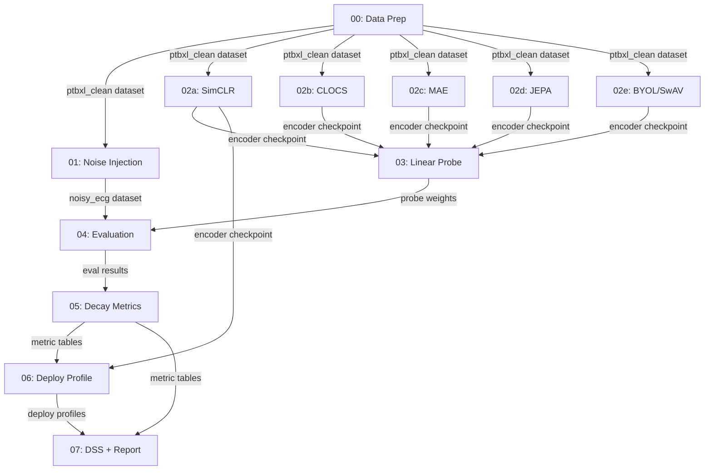

# ECG SSL Robustness & Deployment Safety Score

This repository contains a comprehensive, end-to-end framework for **self-supervised ECG representation learning** and **corruption-aware evaluation** on the PTB-XL 12-lead ECG dataset. It evaluates how SSL encoders degrade under increasing ECG noise and converts these metrics into a multi-objective **Deployment Safety Score (DSS)** tailored for constrained edge-hardware deployment.

## Executive Summary

The pipeline is decomposed into **13 standalone Python scripts**, each designed to run in a separate Kaggle T4 GPU notebook. Outputs are saved as Kaggle Datasets or Models and imported as inputs to subsequent scripts.

## Data Flow Architecture



## Repository Structure & Script Inventory

The project is split into two main components:
1. `ecg_ssl_utils/`: A reusable Python utility package containing shared logic (config, data loading, noise injection, models, SSL trainers, evaluation metrics, and reporting).
2. `scripts/`: Standalone execution scripts `00` through `07` that run each stage of the pipeline sequentially.

| # | Script | Pipeline Stage | Est. Runtime | Kaggle Accelerator |
|---|---|---|---|---|
| 00 | `00_data_preparation.py` | P0 (data) | ~30 min | CPU or GPU |
| 01 | `01_noise_injection.py` | P0 (noise) | ~2–4 h | CPU |
| 02a | `02a_pretrain_simclr.py` | P1 | ~8–10 h | GPU T4 |
| 02b | `02b_pretrain_clocs.py` | P1 | ~8–10 h | GPU T4 |
| 02c | `02c_pretrain_mae.py` | P1 | ~8–10 h | GPU T4 |
| 02d | `02d_pretrain_jepa.py` | P1 | ~8–10 h | GPU T4 |
| 02e | `02e_pretrain_byol_swav.py` | P1 (sensitivity) | ~8–10 h | GPU T4 |
| 03 | `03_linear_probe.py` | P2 | ~1–2 h | GPU T4 |
| 04 | `04_corruption_eval.py` | P2 | ~3–5 h | GPU T4 |
| 05 | `05_decay_metrics.py` | P3 | ~1–2 h | CPU |
| 06 | `06_deploy_profile.py` | P4 | ~2–3 h | CPU (ONNX) |
| 07 | `07_dss_and_report.py` | P5 + P6 | ~1 h | CPU |

## Kaggle Workflow Instructions & Execution Order

This pipeline is highly optimized for Kaggle T4 GPUs (16GB VRAM, <12 hour limit).

1. **First Step**: Upload the `ecg_ssl_utils/` folder as a Kaggle Dataset (e.g., named `ecg-ssl-utils`). In each Kaggle notebook, add this dataset as an input and import it:
   ```python
   import sys
   sys.path.insert(0, '/kaggle/input/ecg-ssl-utils/')
   from ecg_ssl_utils.config import get_config
   ```

2. **Sequential Execution**:
   - **Session 1**: `00_data_preparation.py` → saves `ptbxl-clean-processed` dataset.
   - **Session 2**: `01_noise_injection.py` → saves `noisy-ecg-bank` dataset.
   - **Sessions 3–7**: Run `02a` through `02e` **in parallel** across separate notebooks. Saves checkpoints for SimCLR, CLOCS, MAE, JEPA, BYOL, SwAV, and CLOCS-ResNet18.
   - **Session 8**: `03_linear_probe.py` → saves `linear-probes-all` model.
   - **Session 9**: `04_corruption_eval.py` → saves `corruption-eval-results` dataset.
   - **Session 10**: `05_decay_metrics.py` → saves `decay-metrics-results` dataset.
   - **Session 11**: `06_deploy_profile.py` → saves `deployment-profiles` dataset.
   - **Session 12**: `07_dss_and_report.py` → generates final `ecg-ssl-robustness-report`.

## Methodology Details

### Data Preparation & Noise Injection
- **Dataset**: PTB-XL, using canonical patient-level split (Train: 1-8, Val: 9, Test: 10).
- **Preprocessing**: Bandpass filtering (0.5–45 Hz) and per-lead z-score normalization.
- **Noise Injection**: We use an SNR-scaled injection formula combining MIT-BIH NSTDB records (Baseline Wander, Muscle Artifact, Electrode Motion) and synthetic models (50Hz Powerline, Electrode Pop, Inverter Switching). Injection is done on-the-fly deterministically to avoid saving massive `.npy` arrays.

### SSL Pretraining Setup
All SSL models share a backbone (except one sensitivity arm):
- **Backbone**: ViT-Small (12 layers, 384-d, 6 heads, patch size 50, ~22M params).
- **Budget Parity**: 200 epochs, AdamW, batch size 256, Cosine Annealing, AMP enabled.
- **Augmentations**: Random crop, temporal jitter, amplitude scaling, Gaussian noise, lead dropout, temporal masking.

### Representation Decay Metrics (Script 05)
Evaluates how representations and tasks decay under the 1,134 evaluated noise conditions:
1. **Linear CKA (Centered Kernel Alignment)**: Measures representation geometry similarity between clean and noisy outputs.
2. **Effective Rank (Spectral Entropy)**: Measures dimensionality retention / representational collapse.
3. **Expected Calibration Error (ECE)**: Measures predictive calibration trustworthiness.
4. **Macro AUROC**: Task performance evaluation.
5. **DeLong Test**: Statistical significance for AUROC paired comparisons.
Confidence intervals are estimated via **patient-level bootstrapping**.

### Edge Deployment Profiling (Script 06)
Profiles hardware efficiency using ONNX export and onnxruntime:
- Precision: FP32 and INT8 (Dynamic/Static).
- Execution Providers: CPU and CUDA.
- Latency (p50/p95), peak memory tracing, throughput, and estimated energy consumption.

### Deployment Safety Score (DSS)
The DSS scalar is computed with the following non-compensatory gates:
$$DSS = \alpha(1-\Delta CKA\_n) + \beta(1-\Delta ER\_n) + \gamma(1-ECE\_n) + \delta(1-Latency\_n)$$
If `ECE` or `AUROC` fall below safety threshold gates, the model receives `DSS = 0.0`.
We perform a **Sobol sensitivity analysis** to test ranking stability across weight configurations.

## Open Design Decisions

All decisions are configurable via `ecg_ssl_utils/config.py`:
- **Patch size for ViT**: Default is 50 samples (10ms). Balances sequence length (100 tokens) with temporal resolution.
- **ECG preprocessing filter**: 0.5–45 Hz Butterworth. Removes baseline wander and powerline noise while preserving QRS.
- **MAE mask ratio**: 75% following canonical standards.
- **JEPA EMA momentum**: 0.996 → 1.0 (cosine schedule).
- **DSS normalization**: Reference-anchored min-max for interpretability on the 0-1 range.
- **Bootstrap samples**: 1000 for 95% CI.

## Risk Mitigations

- **Training time > 12h**: Pretraining scripts save checkpoints every 20 epochs. They will automatically resume from `checkpoint.pt` if re-run.
- **VRAM OOM**: Default batch size is 256. AMP is enabled. If OOM still occurs, reduce to 128.
- **Noise bank too large**: We use on-the-fly deterministic noise injection rather than saving massive arrays.
- **Evaluation too slow**: The `04_corruption_eval.py` script iterates in batches and dynamically saves representations as `.npz` files.

## Summary of Mathematical Formulas Used

| Metric/Component | Formula | Source |
|---|---|---|
| SNR-scaled injection | $x_{\text{noisy}} = x + \sqrt{\frac{P_{\text{target}}}{P_{\text{raw}}}} \cdot n_{\text{raw}}$ | Signal Processing Standard |
| NT-Xent (SimCLR) | $-\log \frac{\exp(\text{sim}(z_i, z_j) / \tau)}{\sum_{k} \mathbb{1} \exp(\text{sim}(z_i, z_k) / \tau)}$ | Chen et al., ICML 2020 |
| MAE | $\frac{1}{\|\mathcal{M}\|} \sum_{i \in \mathcal{M}} \| x_i - \hat{x}_i \|^2$ | He et al., CVPR 2022 |
| JEPA | $\frac{1}{\|\mathcal{T}\|} \sum_{i \in \mathcal{T}} \| \hat{s}_{y,i} - \text{sg}(s_{y,i}) \|^2$ | Assran et al., CVPR 2023 |
| BYOL | $2 - 2 \cdot \frac{\langle q_\theta(z_1), z_2' \rangle}{\|q_\theta(z_1)\| \cdot \|z_2'\|}$ | Grill et al., NeurIPS 2020 |
| Linear CKA | $\frac{\|Y^\top X\|_F^2}{\|X^\top X\|_F \cdot \|Y^\top Y\|_F}$ | Kornblith et al., ICML 2019 |
| Effective Rank | $\exp(-\sum \bar{\sigma}_i \ln(\bar{\sigma}_i))$ | Roy & Vetterli, 2007 |
| ECE | $\sum (|B_m|/n) \cdot |acc(B_m) - conf(B_m)|$ | Guo et al., ICML 2017 |
| DeLong Test Z-stat | $\frac{\hat{\theta}_A - \hat{\theta}_B}{\sqrt{\text{Var}(\hat{\theta}_A) + \text{Var}(\hat{\theta}_B) - 2\text{Cov}(\hat{\theta}_A, \hat{\theta}_B)}}$ | DeLong et al., Biometrics 1988 |
| DSS | $\alpha(1-\Delta CKA\_n) + \dots + \delta(1-Latency\_n)$ | DSS Proposal (This project) |