# Representation Decay in Self-Supervised ECG Models Under Graded Noise

A reproducible, patient-level benchmark of self-supervised ECG encoders under graded, deterministic corruption. The benchmark evaluates **task performance**, **calibration**, and **representation shift** with explicit uncertainty estimates. A composite robustness index is reported as a **pre-registered secondary summary**, while the underlying task, calibration, and geometry measurements remain the primary evidence.

**Dataset:** PTB-XL 1.0.3
**Cohort:** 21,799 records / 18,869 patients before diagnostic-label exclusion
**Signal:** 12-lead, 500 Hz, 10 s
**Targets:** NORM · MI · STTC · CD · HYP
**Execution environment:** Kaggle T4 GPU notebooks, 16 GB VRAM, `<12 h` per session
**Deployment profiling:** server-proxy measurements, not edge-hardware measurements

This is an engineering and methodological benchmark on the single-center German PTB-XL cohort. It is **not a clinical validation study** and does not establish clinical safety, diagnostic efficacy, or prospective generalization.

---

## Repository Structure

```text
ECG_SSL_Haqila_Lab/

├── ecg_ssl_utils/               # Reusable utility package
│   ├── config.py                # Central dataclasses
│   ├── repro.py                 # Global seeds + deterministic DataLoaders
│   ├── artifact.py              # Config / seed / git-hash snapshots
│   ├── version.py               # Package version written into artifacts
│   ├── data/                    # Loading, preprocessing, labels
│   ├── noise/                   # NSTDB and synthetic noise generators
│   ├── models/                  # ViT-S 1D, ResNet-18 1D, projectors
│   ├── ssl/                     # SimCLR, CLOCS-adapted, MAE, I-JEPA-adapted,
│   │                             # BYOL, SwAV
│   ├── probe/                   # Linear probe + temperature scaling
│   ├── eval/                    # AUROC, PR-AUC, F1, ECE, Brier, CKA, ER,
│   │                             # bootstrap, DeLong
│   ├── score/                   # Robustness index, decision filters,
│   │                             # Kendall-τ stability
│   ├── deploy/                  # ONNX encoder+probe, INT8, profiling
│   └── report/                  # Leaderboards, curves, risk reports,
│                                 # configuration guidelines
│
├── scripts/                     # Pipeline 00–07
├── tests/
├── requirements.txt
└── README.md
```

---

## Pipeline Overview

| #    | Script                          | Phase   | Description                                                                          |
| ---- | ------------------------------- | ------- | ------------------------------------------------------------------------------------ |
| 00   | `00_data_preparation.py`        | Data    | Raw signal dumps, 0.05–45 Hz `sosfiltfilt`, train-only z-score, diagnostic labels    |
| 01   | `01_noise_injection.py`         | Noise   | NSTDB validation, PSD checks, and 162-condition manifest                             |
| 02a  | `02a_pretrain_simclr.py`        | SSL     | SimCLR across `--seed`                                                               |
| 02b  | `02b_pretrain_clocs.py`         | SSL     | CLOCS-adapted across `--seed`                                                        |
| 02c  | `02c_pretrain_mae.py`           | SSL     | MAE across `--seed`                                                                  |
| 02d  | `02d_pretrain_jepa.py`          | SSL     | I-JEPA-adapted across `--seed`                                                       |
| 02e1 | `02e1_pretrain_byol.py`         | SSL     | BYOL, single-seed sensitivity arm                                                    |
| 02e2 | `02e2_pretrain_swav.py`         | SSL     | SwAV 2-view, single-seed sensitivity arm                                             |
| 02e3 | `02e3_pretrain_clocs_resnet.py` | SSL     | CLOCS-ResNet18, single-seed sensitivity arm                                          |
| 02f  | `02f_supervised_baseline.py`    | SSL     | End-to-end supervised ViT-S reference                                                |
| 03   | `03_linear_probe.py`            | Probe   | Frozen CLS features, linear head, temperature scaling, validation F1 thresholds      |
| 04   | `04_corruption_eval.py`         | Eval    | Raw-mV corruption injection followed by the standard preprocessing pipeline          |
| 05   | `05_decay_metrics.py`           | Stats   | Patient-clustered bootstrap, paired ΔAUROC tests, and prespecified BH-FDR family     |
| 06   | `06_deploy_profile.py`          | Deploy  | INT8 export, parity measurement, latency, throughput, and RSS profiling              |
| 07   | `07_dss_and_report.py`          | Reports | Secondary robustness index, Kendall-τ stability, parity checks, and decision support |

---

## Methodology

```mermaid
flowchart LR

    subgraph L1["I. DATA, LABELS, PREPROCESSING AND NOISE PROTOCOL"]

        A["PTB-XL 1.0.3<br/>21,799 records · 18,869 patients before exclusion<br/>12-lead · 500 Hz · 10 s"]

        B["Signal Preprocessing<br/>4th-order Butterworth 0.05–45 Hz<br/>sosfiltfilt (zero-phase, SOS-stable)<br/>Writes unfiltered signals_*_raw.npy<br/>Per-lead z-score from TRAIN statistics only"]

        LAB["Diagnostic Label Construction<br/>Official PTB-XL diagnostic-superclass mapping<br/>All listed diagnostic SCP statements<br/>NORM · MI · STTC · CD · HYP (multi-label)<br/>Exclude records with no diagnostic superclass<br/>Likelihood >50 cohort saved for sensitivity analysis"]

        C["Patient-Level Split<br/>Folds 1–8 train · 9 validation · 10 test<br/>Patient disjointness asserted"]

        N1["Empirical Noise Bank: MIT-BIH NSTDB<br/>BW · MA · EM · 2-channel · 360 Hz<br/>resample_poly → 500 Hz<br/>20 templates × 10 s per type<br/>Hard-fail when required files are missing<br/>2-channel → 12-lead replication documented as an approximation"]

        N2["Synthetic Noise Bank<br/>Powerline: 50 Hz + harmonics, A_h = 1/h<br/>Electrode-pop: Poisson Gaussian transients<br/>Inverter: band-limited burst model<br/>20 templates per type"]

        QC["Noise-Bank Checks<br/>PSD plots per type<br/>SNR round-trip checks<br/>Pre/post-filter SNR and PSD logged"]

        INJ["Option-A Corruption Injection<br/>Noise added in raw mV<br/>x_noisy = x + k·n<br/>RNG = RandomState(seed + record_id)<br/>Deterministic given record, type, SNR, seed"]

        SCALE["Fixed Input-Scale Policy<br/>No dual renormalization<br/>Noisy signals use the same front end<br/>and saved train normalization statistics<br/>45 Hz front end attenuates 50 Hz mains content"]

        GRID["Graded Corruption Grid<br/>6 single types × 6 SNR × 3 noise seeds = 108<br/>3 mixtures × 6 SNR × 3 noise seeds = 54<br/>SNR = −6, 0, 6, 12, 18, 24 dB<br/>162 conditions per encoder"]

    end

    subgraph L2["II. SELF-SUPERVISED PRETRAINING"]

        BB["Shared ViT-S 1D Backbone<br/>12 layers · 384-d · 6 heads · patch 50 · ~22M<br/>101 tokens: 100 patches + CLS<br/>200 epochs · AdamW · AMP<br/>Epoch parity, not compute parity<br/>Physical batch 256, accumulation ×4<br/>CLOCS-ViT: physical batch 128, accumulation ×8"]

        SEED["Pretraining Seeds<br/>Primary: 42 · 123 · 456<br/>Sensitivity arms: 1 seed<br/>Primary paradigms reported as mean ± SD"]

        SUP["Supervised Reference<br/>End-to-end ViT-S<br/>Same splits · 3 seeds"]

        M1["SimCLR<br/>NT-Xent · instance-discriminative"]

        M2["CLOCS-adapted<br/>Temporal / lead / patient NT-Xent<br/>τ = 0.5 · patient-pair batches"]

        M3["MAE<br/>75% masking<br/>Decoder retained in checkpoint"]

        M4["I-JEPA-adapted<br/>EMA target · L2 objective<br/>Target patches + CLS"]

        M5["BYOL<br/>Single-seed sensitivity arm"]

        M6["SwAV (2-view)<br/>Single-seed sensitivity arm<br/>Sinkhorn Q* = B under AMP"]

        M7["CLOCS-ResNet18 1D<br/>Single-seed CNN control"]

        CKPT["Encoder Checkpoints<br/>4 primary SSL paradigms × 3 seeds<br/>3 sensitivity arms × 1 seed<br/>Supervised reference × 3 seeds"]

    end

    subgraph L3["III. FROZEN-ENCODER CLASSIFICATION AND ROBUSTNESS EVALUATION"]

        LP["Linear Probe on CLEAN DATA ONLY<br/>Frozen encoder → CLS → linear head<br/>Train folds 1–8 · validation fold 9<br/>50 epochs · early stop on validation macro-AUROC<br/>Single temperature T* fitted to raw validation logits<br/>Validation-tuned per-class F1 thresholds"]

        FP["Frozen Evaluation<br/>Encoder + probe weights remain fixed<br/>SHA-256 file hashes and in-loop parameter hashes<br/>No retraining or adaptation under corruption"]

        UNIFIED["Unified Inference Path<br/>Same predict_proba for clean and noisy data<br/>Temperature applied exactly once"]

        CLEAN["Clean Reference<br/>Clean test ECG → frozen encoder → frozen probe"]

        NOISY["Direct Noisy Evaluation<br/>Noisy test ECG → frozen encoder → frozen probe<br/>No denoiser or adaptation"]

        PAIRED["Paired Robustness Analysis<br/>Same record and labels<br/>Clean vs corresponding noisy version"]

        T1["Classification<br/>Macro-AUROC · per-class F1<br/>PR-AUC · Brier"]

        T2["Calibration<br/>OvR ECE, 15 equal-width bins<br/>Equal-mass ECE as a check column<br/>Single scalar temperature"]

        T3["Representation Geometry<br/>Last-layer CLS only<br/>ΔCKA = 1 − linear CKA(clean, noisy)<br/>Variance-collapse guard<br/>Effective rank of CLS matrix<br/>Two-sided ΔER"]

        RDC[("Task / Calibration / Geometry Tables<br/>Model × noise type × SNR<br/>Relative to clean reference")]

    end

    subgraph L4["IV. STATISTICAL VALIDATION"]

        S1["Patient-Level Bootstrap<br/>1,000 resamples · 95% percentile CIs<br/>Point estimate = full-sample metric<br/>ER bootstrap: 200 resamples, subsample 1500"]

        S2["Paired ΔAUROC Tests<br/>Patient-clustered bootstrap<br/>Noise-seed-averaged probabilities<br/>DeLong reported appendix-only"]

        S3["Variance Sources<br/>Patient sampling<br/>Noise seed<br/>Pretraining seed"]

        MULTI["Multiple-Comparison Control<br/>BH-FDR prespecified family only<br/>Encoder × {BW, MA, EM} × class at 0 dB<br/>Other SNR/type rows are exploratory"]

    end

    subgraph L5["V. ROBUSTNESS INDEX (SECONDARY)"]

        RS["Robustness Index R<br/>0.30(1−ΔAUROC_n) + 0.30(1−ΔECE_n)<br/>+ 0.20(1−ΔCKA_n) + 0.20(1−ΔER_n)<br/>Deltas min-max normalized within the run<br/>Anchors saved to normalization_anchors.json"]

        RGATE{"Decision Filters<br/>AUROC < 0.70?<br/>ECE > 0.15?"}

        RSCORE["R remains reported when a filter fails<br/>Primary evidence: raw_dimensions.parquet"]

        STAB["Weight Stability<br/>1,024 Dirichlet draws<br/>Kendall τ + top-1 agreement<br/>Compared with pre-registered weights"]

    end

    subgraph L6["VI. SERVER-PROXY DEPLOYMENT PROFILING"]

        ONNX["ONNX Export<br/>Encoder + probe · Opset 17 · FP32<br/>INT8 dynamic + INT8 static<br/>Static calibration on TRAIN signals"]

        QPAR["Quantization Parity<br/>Cosine(FP32, INT8) on 500 validation samples<br/>Minimum acceptable cosine = 0.999"]

        P1["Latency<br/>CPU ONNX Runtime only<br/>p50 / p95"]

        P2["Memory<br/>Process RSS delta via psutil"]

        P3["Throughput<br/>1 / mean latency<br/>Energy not measured"]

        DP["Deployment Profile<br/>Model × quantization × provider<br/>Latency · RSS · throughput · platform metadata"]

    end

    subgraph L7["VII. DEPLOYMENT-AWARE DECISION SUPPORT"]

        DS["Decision-Support Engine<br/>Index at −6 dB, averaged across noise types<br/>Minimum-index view<br/>Deployment profile<br/>Parity cosine<br/>Kendall-τ stability"]

        DGATE{"Constraints<br/>R ≥ 0.50?<br/>AUROC/ECE filters passed?<br/>p95 latency ≤ 100 ms?<br/>RSS ≤ 512 MB?<br/>Parity cosine ≥ 0.999?"}

        REJECT["Configuration Rejected"]

        RECOMMEND["Rank feasible model × quantization × hardware<br/>RECOMMEND when τ-stability ≥ 0.90<br/>Otherwise RECOMMEND_QUALIFIED"]

        R1["Leaderboard"]
        R2["Configuration Guidelines"]
        R3["Per-Noise-Type Risk Reports"]

    end

    A --> B
    A --> LAB
    B --> C
    LAB --> C

    N1 --> QC
    N2 --> QC
    QC --> INJ
    INJ --> SCALE
    SCALE --> GRID

    C --> INJ
    C --> BB
    C --> SUP
    C --> CLEAN

    BB --> M1
    BB --> M2
    BB --> M3
    BB --> M4
    BB -.-> M5
    BB -.-> M6
    BB -.-> M7

    SEED -.-> M1
    SEED -.-> M2
    SEED -.-> M3
    SEED -.-> M4
    SEED -.-> M5
    SEED -.-> M6
    SEED -.-> M7

    M1 --> CKPT
    M2 --> CKPT
    M3 --> CKPT
    M4 --> CKPT
    M5 --> CKPT
    M6 --> CKPT
    M7 --> CKPT
    SUP --> CKPT

    CKPT --> LP
    CKPT --> ONNX

    LP --> FP
    FP --> UNIFIED
    UNIFIED --> CLEAN
    UNIFIED --> NOISY

    GRID --> NOISY

    CLEAN --> PAIRED
    NOISY --> PAIRED

    PAIRED --> T1
    PAIRED --> T2
    PAIRED --> T3

    T1 --> RDC
    T2 --> RDC
    T3 --> RDC

    RDC --> S1
    RDC --> S2
    RDC --> S3

    S1 --> RS
    S1 --> MULTI
    S2 --> MULTI
    S3 --> MULTI
    MULTI --> RS

    RS --> RGATE
    RGATE --> RSCORE
    RSCORE --> STAB

    ONNX --> QPAR
    QPAR --> P1
    QPAR --> P2
    QPAR --> P3

    P1 --> DP
    P2 --> DP
    P3 --> DP

    DP --> DS
    STAB --> DS
    RSCORE --> DS

    DS --> DGATE
    DGATE -- "Constraint failure" --> REJECT
    DGATE -- "Constraints satisfied" --> RECOMMEND

    RECOMMEND --> R1
    RECOMMEND --> R2
    RECOMMEND --> R3

    classDef data fill:#E3F2FD,stroke:#1565C0,stroke-width:1.5px
    classDef labels fill:#E8EAF6,stroke:#3949AB,stroke-width:1.5px
    classDef model fill:#F3E5F5,stroke:#6A1B9A,stroke-width:1.5px
    classDef sens fill:#F3E5F5,stroke:#6A1B9A,stroke-width:1.5px,stroke-dasharray:6 4
    classDef eval fill:#E8F5E9,stroke:#2E7D32,stroke-width:1.5px
    classDef rdc fill:#C8E6C9,stroke:#1B5E20,stroke-width:2.5px
    classDef robust fill:#FFF3E0,stroke:#E65100,stroke-width:1.5px
    classDef deploy fill:#FFF8E1,stroke:#EF6C00,stroke-width:1.5px
    classDef decision fill:#FFEBEE,stroke:#B71C1C,stroke-width:1.5px
    classDef artifact fill:#FFFDE7,stroke:#F57F17,stroke-width:1.5px

    class A,B,C,N1,N2,INJ,GRID data
    class LAB labels
    class BB,M1,M2,M3,M4,CKPT model
    class M5,M6,M7 sens
    class LP,FP,UNIFIED,CLEAN,NOISY,PAIRED,T1,T2,T3 eval
    class RDC rdc
    class S1,S2,S3,MULTI,RS,RGATE,RSCORE,STAB robust
    class ONNX,QPAR,P1,P2,P3,SEED,SUP,QC,SCALE deploy
    class DS,DGATE,REJECT,RECOMMEND decision
    class R1,R2,R3 artifact
```



---

## I. Data, labels, preprocessing, and noise

### Signal preprocessing

* **Filter:** 4th-order Butterworth **0.05–45 Hz** using `sosfiltfilt`.
* **Normalization:** per-lead z-score using **training-set statistics only**.
* **Raw signals:** `00_data_preparation.py` also saves the unfiltered signals as `signals_{split}_raw.npy`.
* **Split:** PTB-XL folds 1–8 for training, fold 9 for validation, and fold 10 for testing. Patient disjointness is asserted.
* **Dataset integrity:** `--strict-dataset` asserts 21,799 records and 18,869 patients before diagnostic-label exclusion.

### Diagnostic labels

The benchmark uses the official PTB-XL diagnostic-superclass aggregation across the listed diagnostic SCP statements.

The target superclasses are:

`NORM · MI · STTC · CD · HYP`

The task is multi-label. Records with no diagnostic superclass are excluded from the evaluation cohort.

A separate likelihood-based cohort using `likelihood > 50` is retained as a sensitivity-analysis artifact under:

```text
superclass_labels_likelihood_gt50_*
```

This cohort is not used as the primary label definition.

### Noise sources

**Empirical NSTDB noise**

* Baseline wander: BW
* Muscle artifact: MA
* Electrode motion: EM
* 2-channel, 360 Hz source signals resampled to 500 Hz with `resample_poly`
* 20 templates × 10 s per noise type
* Required files are validated with a hard failure
* Two-channel noise is replicated to 12 leads using a documented approximation

**Synthetic noise**

* **Powerline:** 50 Hz plus harmonics with $A_h = 1/h$
* **Electrode-pop:** Poisson Gaussian transients
* **Inverter:** band-limited burst model

Synthetic noise is used as a physically motivated corruption model, not as a claim of clinical realism.

### Corruption injection

Script 04 uses the following sequence:

1. Start from the unfiltered ECG in raw mV.
2. Add the selected corruption at the target broadband SNR.
3. Apply the same 0.05–45 Hz preprocessing used for clean data.
4. Apply the same train-derived normalization statistics.

For corruption $n$:

```math
x_{\text{noisy}} = x + k n
```

The noise realization is deterministic given:

```text
(record_id, noise_type, SNR, noise_seed)
```

with:

```python
RandomState(seed + record_id)
```

Because the front end ends at 45 Hz, the preprocessing stage attenuates 50 Hz mains content after injection. This interaction is part of the benchmark definition.

### Corruption grid

**Single-noise conditions**

```math
6\ \text{noise types} \times 6\ \text{SNR levels} \times 3\ \text{noise seeds} = 108
```

**Mixture conditions**

```math
3\ \text{mixtures} \times 6\ \text{SNR levels} \times 3\ \text{noise seeds} = 54
```

Total:

```math
108 + 54 = \mathbf{162}
```

SNR levels:

```text
−6, 0, 6, 12, 18, 24 dB
```

Noise-bank checks include PSD plots and SNR round-trip diagnostics. Script 04 records pre-filter and post-filter SNR and PSD information.

---

## II. Self-supervised pretraining

The primary SSL paradigms share a ViT-S 1D backbone:

```text
12 layers
384-dimensional hidden size
6 attention heads
Patch size = 50
101 tokens = 100 patches + CLS
~22M parameters
200 epochs
AdamW
AMP
```

Training uses **epoch parity rather than compute parity**, with the per-method optimizer and batch configuration explicitly documented.

| Encoder          | Script | Seeds        | Configuration                                                    |
| ---------------- | ------ | ------------ | ---------------------------------------------------------------- |
| SimCLR           | `02a`  | 42, 123, 456 | NT-Xent, physical batch 256, accumulation ×4                     |
| CLOCS-adapted    | `02b`  | 42, 123, 456 | τ=0.5, patient-pair batches, physical batch 128, accumulation ×8 |
| MAE              | `02c`  | 42, 123, 456 | 75% masking, decoder retained in checkpoint                      |
| I-JEPA-adapted   | `02d`  | 42, 123, 456 | EMA target, L2 objective, target patches + CLS                   |
| BYOL             | `02e1` | 1 seed       | Sensitivity arm                                                  |
| SwAV (2-view)    | `02e2` | 1 seed       | Sensitivity arm                                                  |
| CLOCS-ResNet18   | `02e3` | 1 seed       | Sensitivity arm                                                  |
| Supervised ViT-S | `02f`  | 42, 123, 456 | End-to-end supervised reference                                  |

`--seed` or `PRETRAIN_SEED` is required for pretraining runs.

Outputs follow:

```text
ssl-<paradigm>-seed<seed>/
```

### Primary and sensitivity arms

The primary statistical summaries cover:

* SimCLR
* CLOCS-adapted
* MAE
* I-JEPA-adapted

using seeds:

```text
42, 123, 456
```

These are summarized as mean ± SD across pretraining seeds.

BYOL, SwAV, and CLOCS-ResNet18 are single-seed sensitivity arms. They are explicitly flagged and are not ranked against the primary paradigms without that qualification.

### Collapse diagnostics

The benchmark monitors encoder collapse using:

```text
CLS embedding std < 1e-4
or
mean pairwise cosine > 0.95
```

Handling is paradigm-specific:

* **SimCLR / CLOCS-ViT:** training halts after 5 consecutive bad checks.
* **BYOL / SwAV / CLOCS-ResNet18:** diagnostics are logged every epoch.
* **I-JEPA:** collapse warnings are printed and training continues.
* **MAE:** reconstruction loss and encoder CLS diagnostics are tracked.

Gradient accumulation controls optimizer update frequency. It does not increase the number of in-batch negatives for NT-Xent and does not change the number of assignments presented to the SwAV Sinkhorn step.

All scripts process a final partial accumulation window rather than dropping it.

Residual AMP and cuDNN nondeterminism may remain even with:

```python
cudnn.deterministic = True
```

---

## III. Frozen evaluation

### Linear probe

The probe is trained on **clean data only**:

```text
Frozen encoder → CLS representation → linear classification head
```

Training split:

```text
Folds 1–8
```

Validation split:

```text
Fold 9
```

Probe configuration:

```text
50 epochs
Adam
Early stopping on validation macro-AUROC
```

### Temperature scaling

A single scalar temperature $T^*$ is fitted to **raw validation logits**.

The fitted temperature is applied exactly once in the inference path:

```text
logits → temperature scaling → predict_proba
```

The same calibrated inference path is used for both clean and corrupted test data.

### F1 thresholds

Per-class F1 thresholds are selected on the validation set over:

```text
0.05, 0.06, ..., 0.95
```

The selected thresholds are fixed and reused for clean and noisy test evaluation.

### Frozen weights and integrity checks

The encoder and probe remain fixed throughout corruption evaluation.

The pipeline records:

* SHA-256 file hashes
* In-loop parameter hashes
* Floating-point representations in FP32 for stored embeddings

No retraining, fine-tuning, denoising, or corruption-specific adaptation is performed during evaluation.

---

## IV. Task, calibration, and representation metrics

Evaluation is paired at the record level. Each noisy test example is matched to its clean counterpart and retains the same labels.

### Classification

Reported metrics include:

* Macro-AUROC
* Per-class AUROC
* PR-AUC
* Per-class F1 using validation-selected thresholds
* Brier score

Targets:

```text
NORM · MI · STTC · CD · HYP
```

### Calibration

Primary calibration metric:

* One-vs-rest ECE using **15 equal-width bins**

Additional calibration output:

* Equal-mass ECE as a check column

Only one scalar temperature is used.

### Representation geometry

Representation analysis uses the **last-layer CLS representation**.

**Linear CKA**

```math
\Delta \mathrm{CKA}
=
1-\mathrm{CKA}(X_{\text{clean}},X_{\text{noisy}})
```

A variance-collapse guard is applied before interpreting CKA.

**Effective rank**

Effective rank is computed from the CLS matrix:

```math
X \in \mathbb{R}^{n_{\text{samples}} \times d_{\text{embed}}}
```

The robustness index uses the two-sided effective-rank change:

```math
\Delta \mathrm{ER}
=
\left|
1-\frac{\mathrm{ER}_{n}}{\mathrm{ER}_{c}}
\right|
```

CKA and effective-rank measurements are treated as **representation-shift diagnostics**. They are not, by themselves, evidence that task-relevant information has been lost. Interpretation of representation decay is therefore tied primarily to changes in task performance and calibration.

---

## V. Statistical analysis

The benchmark separates three sources of variability:

1. **Patient sampling**
2. **Corruption realization**
3. **Pretraining initialization and data order**

### Patient-level confidence intervals

Point estimates are computed from the full evaluation sample.

Confidence intervals use:

```text
1,000 patient-level bootstrap resamples
95% percentile intervals
```

Bootstrap resampling preserves the dependence between multiple records from the same patient.

The primary classification and calibration CIs operate on **noise-seed-averaged probabilities**.

Confidence-interval bounds are computed from the bootstrap distribution and are not averaged across bootstrap replicates or seeds.

For effective rank:

```text
200 bootstrap resamples
1,500-sample subsample per resample
```

### Paired ΔAUROC testing

The primary paired robustness test uses patient-clustered bootstrap resampling on noise-seed-averaged predictions.

No p-values are averaged across noise seeds.

DeLong statistics are provided for appendix-level reference only because the standard independence assumption does not hold for a multi-record-per-patient cohort.

### Pretraining-seed variability

For the primary paradigms:

```text
42, 123, 456
```

results are summarized as mean ± SD across pretraining seeds.

Sensitivity arms use one pretraining seed and remain explicitly flagged.

### Multiple comparisons

Benjamini-Hochberg FDR correction is applied only to the prespecified primary family:

```text
encoder × {BW, MA, EM} × class at 0 dB
```

All other noise-type, mixture, SNR, and class combinations are exploratory.

The tested family is recorded in:

```text
bh_family.json
```

---

## VI. Robustness index

The robustness index is a **secondary reporting and ranking convenience**. The underlying four dimensions remain the primary evidence.

```math
R =
0.30(1-\Delta\mathrm{AUROC}_{n})
+
0.30(1-\Delta\mathrm{ECE}_{n})
+
0.20(1-\Delta\mathrm{CKA}_{n})
+
0.20(1-\Delta\mathrm{ER}_{n})
```

The component deltas are:

```math
\Delta\mathrm{CKA}
=
1-\mathrm{CKA}
```

```math
\Delta\mathrm{ER}
=
\left|
1-\frac{\mathrm{ER}_{n}}{\mathrm{ER}_{c}}
\right|
```

```math
\Delta\mathrm{AUROC}
=
\max(0,\mathrm{AUC}_{c}-\mathrm{AUC}_{n})
```

```math
\Delta\mathrm{ECE}
=
\max(0,\mathrm{ECE}_{n}-\mathrm{ECE}_{c})
```

The deltas are min-max normalized **within the current run**. The normalization anchors are stored in:

```text
normalization_anchors.json
```

Therefore, $R$ is intended for **within-run comparison** and should not be compared numerically across papers or independently reproduced runs with different normalization anchors.

### Decision filters

The following are filters for deployment-oriented decision support:

```text
AUROC < 0.70
ECE > 0.15
```

A failed filter does **not** set $R=0$.

The unaggregated evidence is retained in:

```text
raw_dimensions.parquet
```

### Weight stability

Ranking stability is evaluated with:

```text
1,024 Dirichlet weight draws
Kendall τ against the pre-registered ranking
Top-1 agreement
```

---

## VII. Server-proxy deployment profiling

Deployment measurements characterize a server-style inference environment rather than an edge device.

### ONNX export

The exported graph contains:

```text
Encoder + probe
Opset 17
FP32
INT8 dynamic quantization
INT8 static quantization
```

Static quantization is calibrated using training signals only.

The profiler uses CPU ONNX Runtime. GPU inference execution providers are outside the deployment profile.

### Quantization parity

FP32 and INT8 outputs are compared using cosine similarity on:

```text
500 validation samples
```

The minimum accepted parity is:

```text
cosine ≥ 0.999
```

The parity threshold is read from:

```text
cfg.deploy.parity_min_cosine
```

### Profiling measurements

The deployment profile records:

* Latency p50
* Latency p95
* Throughput
* Process RSS delta using `psutil`
* CPU / platform metadata
* ONNX Runtime version
* Quantization mode

The profiling protocol uses:

```text
50 warm-up runs
1,000 timed runs
```

Throughput is calculated as:

```math
\mathrm{throughput}
=
\frac{1}{\mathrm{mean\ latency}}
```

Energy consumption is not measured and is not reported.

The deployment path does not include a selective precision mode such as FP32 attention with INT8 feed-forward layers.

---

## VIII. Deployment-aware decision support

The decision-support engine combines the secondary robustness index, deployment measurements, quantization parity, and ranking stability.

The primary index view is evaluated at:

```text
−6 dB
```

and averaged across noise types. Additional views include the minimum-index condition and the full deployment profile.

A configuration must satisfy the deployment constraints to enter the feasible ranking:

```text
R ≥ 0.50
AUROC/ECE filters passed
p95 latency ≤ 100 ms
RSS ≤ 512 MB
quantization cosine ≥ 0.999
```

Configurations that violate a constraint are marked:

```text
REJECT
```

Feasible configurations are ranked by model, quantization, and hardware/provider.

Recommendation labels are:

```text
RECOMMEND
```

when Kendall-τ stability is at least:

```text
0.90
```

and:

```text
RECOMMEND_QUALIFIED
```

otherwise.

Generated outputs include:

* Leaderboard
* Configuration guidelines
* Per-noise-type risk reports

---

## Kaggle Execution

The full execution graph is:

```text
00 → 01

02a–02d × seeds {42, 123, 456}
    = 12 primary SSL sessions

02e1, 02e2, 02e3
    = 1 seed each, sensitivity arms

02f × seeds {42, 123, 456}
    = 3 supervised reference sessions

03 → 04 → 05 → 06 → 07
```

Upload `ecg_ssl_utils/` as a Kaggle dataset.

Example notebook setup:

```python
import sys

sys.path.insert(0, "/kaggle/input/ecg-ssl-utils/")

from ecg_ssl_utils.config import get_config
```

Before citing numerical results, remove stale artifacts from scripts 05 and 07.

Unseeded historical checkpoints are not valid inputs for the paper's primary tables.

---

## Reproducibility

`requirements.txt` specifies runtime dependencies.

After a final paper run, export the exact environment:

```text
environment.lock.txt
```

using `pip freeze` from the execution image.

Each major script records configuration and reproducibility metadata, including where applicable:

```text
config.json
run_snapshot.json
seed
package version
git hash
```

Dataset version:

```text
PTB-XL 1.0.3
```

Test suite:

```bash
pytest tests/
```

The tests cover components including:

* Linear CKA
* Effective rank
* ECE
* Patient bootstrap
* SNR round-trip behavior
* Sinkhorn assignments
* Single-temperature application
* Seeded SimCLR first-batch loss

---

## Known Limitations

### Dataset and clinical scope

* The study uses a single-center German PTB-XL cohort.
* There is no prospective, external-site, or multi-center clinical validation.
* Deployment measurements are server proxies rather than edge-device benchmarks.

### SSL comparability

* Contrastive methods share a six-augmentation policy.
* MAE and I-JEPA use masking or block-prediction objectives.
* Consequently, representation differences reflect both objective design and the associated augmentation or masking strategy.

### Representation interpretation

* CKA and effective rank operate on the last-layer CLS representation.
* They characterize representation shift and dimensionality change, not direct preservation or loss of task-relevant information.
* Conclusions about robustness should therefore prioritize ΔAUROC, ΔECE, and ΔF1 alongside geometry metrics.

### Statistical interpretation

* The robustness index is normalized within each run and is not a cross-paper absolute score.
* DeLong does not model patient clustering and is therefore appendix-only.
* Sensitivity arms use one pretraining seed and should not be interpreted as statistically equivalent to the three-seed primary paradigms.

### Method implementation scope

* CLOCS and I-JEPA are ECG-specific adaptations rather than claims of exact canonical implementations.
* NSTDB noise is empirically sourced, while the synthetic noise models are physically motivated approximations.
* The 2-channel-to-12-lead NSTDB replication is an explicit approximation.
* The benchmark does not use a denoising model or corruption-specific adaptation during evaluation.

### Front-end interaction

* The 45 Hz preprocessing cutoff attenuates 50 Hz powerline content after corruption injection.
* This interaction is intrinsic to the defined preprocessing and corruption pipeline.

---

## Configuration Defaults

| Parameter                          | Default                                                    |
| ---------------------------------- | ---------------------------------------------------------- |
| Band-pass                          | 0.05–45 Hz, order 4, `sosfiltfilt`                         |
| Label construction                 | Official diagnostic-superclass mapping; exclude empty rows |
| SSL epochs                         | 200; AdamW                                                 |
| Optimizer accumulation             | 4; CLOCS-ViT = 8                                           |
| Physical contrastive batch         | 256; CLOCS-ViT = 128                                       |
| Primary pretraining seeds          | 42, 123, 456                                               |
| Noise seeds                        | 42, 123, 456                                               |
| Linear probe                       | 50 epochs, validation early stop                           |
| Temperature scaling                | Single validation-fitted scalar, applied once              |
| F1 thresholds                      | Validation sweep from 0.05 to 0.95                         |
| ECE                                | 15 equal-width bins; equal-mass check column               |
| Patient bootstrap                  | 1,000 resamples                                            |
| Effective-rank bootstrap           | 200 resamples, 1,500-sample subsample                      |
| Index weights                      | AUROC 0.30, ECE 0.30, CKA 0.20, ER 0.20                    |
| Decision filters                   | AUROC 0.70, ECE 0.15                                       |
| Quantization                       | FP32, INT8 dynamic, INT8 static                            |
| Static quantization calibration    | Training signals                                           |
| Parity threshold                   | Cosine ≥ 0.999                                             |
| Deployment runtime                 | CPU ONNX Runtime                                           |
| Deployment warm-up                 | 50 runs                                                    |
| Deployment measurement             | 1,000 runs                                                 |
| Decision latency threshold         | p95 ≤ 100 ms                                               |
| Decision memory threshold          | RSS ≤ 512 MB                                               |
| Recommendation stability threshold | Kendall τ ≥ 0.90                                           |
