# Representation Decay in Self-Supervised ECG Models Under Graded Noise

A reproducible, patient-safe benchmark of self-supervised ECG encoders under graded, deterministic corruption: paired **task**, **calibration**, and **representation-shift** analysis with uncertainty. The composite robustness index is a pre-registered **secondary** reporting convenience.

**Dataset**: PTB-XL 1.0.3 (21,799 records / 18,869 patients before official diagnostic-label exclusion; 12-lead, 500 Hz, 10 s)
**Target**: 5 diagnostic superclasses — NORM · MI · STTC · CD · HYP
**Execution environment**: Kaggle T4 GPU notebooks (16 GB VRAM, &lt;12 h). Deployment numbers are **server-proxy**, not edge hardware.

This is an engineering / methodological benchmark on a single-center German cohort. It is **not** a clinical validation study.

---

## Repository Structure

```
ECG_SSL_Haqila_Lab/
├── ecg_ssl_utils/               # Reusable utility package
│   ├── config.py                # Central dataclasses
│   ├── repro.py                 # Global seeds + deterministic DataLoaders
│   ├── artifact.py              # Config / seed / git-hash snapshots
│   ├── version.py               # Package version written into artifacts
│   ├── data/                    # Load, sosfiltfilt 0.05–45 Hz, labels
│   ├── noise/                   # NSTDB (hard-fail) + synthetic generators
│   ├── models/                  # ViT-S 1D, ResNet-18 1D, projectors
│   ├── ssl/                     # SimCLR, CLOCS-adapted, MAE, I-JEPA-adapted, BYOL, SwAV
│   ├── probe/                   # Linear probe + temperature scaling
│   ├── eval/                    # AUROC, PR-AUC, F1, ECE, Brier, CKA, ER, bootstrap, DeLong
│   ├── score/                   # Robustness index, gates (filters), Kendall-τ stability
│   ├── deploy/                  # ONNX encoder+probe, INT8, server-proxy profiler
│   └── report/                  # Leaderboard, curves, risk reports, guidelines
├── scripts/                     # Pipeline 00–07 (each script is a Kaggle session)
├── tests/
├── requirements.txt
└── README.md
```

---

## Pipeline Overview

| # | Script | Phase | Notes |
|---|--------|-------|-------|
| 00 | `00_data_preparation.py` | Data | Raw dumps, 0.05–45 Hz `sosfiltfilt`, train-only z-score, official PTB-XL labels |
| 01 | `01_noise_injection.py` | Noise | NSTDB hard-fail + PSD plots + 162-condition manifest |
| 02a | `02a_pretrain_simclr.py` | SSL | SimCLR × `--seed` |
| 02b | `02b_pretrain_clocs.py` | SSL | CLOCS-adapted × `--seed` |
| 02c | `02c_pretrain_mae.py` | SSL | MAE × `--seed` |
| 02d | `02d_pretrain_jepa.py` | SSL | I-JEPA-adapted × `--seed` |
| 02e1 | `02e1_pretrain_byol.py` | SSL | BYOL sensitivity arm (1 seed, flagged) |
| 02e2 | `02e2_pretrain_swav.py` | SSL | SwAV 2-view sensitivity arm (1 seed, flagged) |
| 02e3 | `02e3_pretrain_clocs_resnet.py` | SSL | CLOCS-ResNet18 sensitivity arm (1 seed, flagged) |
| 02f | `02f_supervised_baseline.py` | SSL | End-to-end ViT-S, same splits |
| 03 | `03_linear_probe.py` | Probe | Frozen CLS → linear head; T applied **once**; val-tuned F1 thresholds |
| 04 | `04_corruption_eval.py` | Eval | Inject on **raw mV**, then identical front-end; SHA-256 immutability |
| 05 | `05_decay_metrics.py` | Stats | Clustered bootstrap on seed-averaged predictions + prespecified BH family |
| 06 | `06_deploy_profile.py` | Deploy | Train-calibrated INT8, parity numbers, RSS memory, real ECG input |
| 07 | `07_dss_and_report.py` | Reports | Secondary robustness index + Kendall-τ stability + parity/AUROC/ECE filters |

---

## Methodology (what the code actually does)

```mermaid
flowchart LR

    subgraph L1["I. DATA, LABELS, PREPROCESSING AND NOISE PROTOCOL"]

        A["PTB-XL 1.0.3<br/>21,799 records · 18,869 patients before exclusion<br/>12-lead · 500 Hz · 10 s"]

        B["Signal Preprocessing<br/>4th-order Butterworth 0.05–45 Hz<br/>sosfiltfilt (zero-phase, SOS-stable)<br/>Also writes unfiltered signals_*_raw.npy<br/>Per-lead z-score from TRAIN stats only"]

        LAB["Diagnostic Label Construction<br/>Official PTB-XL diagnostic-superclass map<br/>every listed diagnostic SCP statement<br/>NORM · MI · STTC · CD · HYP (multi-label)<br/>Drop all-zero superclass rows<br/>likelihood &gt;50 saved as sensitivity cohort"]

        C["Patient-Level PTB-XL Split<br/>Folds 1–8 train · 9 val · 10 test<br/>Patient-disjointness asserted"]

        N1["Empirical Noise Bank — MIT-BIH NSTDB<br/>BW · MA · EM, 2-channel, 360 Hz<br/>resample_poly → 500 Hz<br/>20 templates × 10 s (script 01)<br/>Hard-fail if files missing (no Gaussian fallback)<br/>2-ch → 12-lead replication (documented approx.)"]

        N2["Synthetic Noise Bank (physically motivated)<br/>Powerline: 50 Hz + h=1,2,3 (A_h=1/h)<br/>Electrode-pop: Poisson Gaussian transients<br/>Inverter: band-limited burst model, flagged synthetic<br/>20 templates per type"]

        QC["Noise-Bank Checks (non-blocking)<br/>PSD plots per type · SNR round-trip prints<br/>Script 04 logs pre/post-filter SNR and PSD"]

        INJ["Option-A Injection (test only)<br/>Add noise on raw mV, then identical front-end<br/>Broadband SNR: x_noisy = x + k·n<br/>RNG: RandomState(seed + record_id)<br/>Deterministic given (record, type, SNR, seed) via manifest"]

        SCALE["Fixed Input-Scale Policy<br/>No dual re-normalize vs raw arms<br/>Noisy inputs always band-pass + saved train z-score<br/>45 Hz front-end attenuates 50 Hz mains (a finding)"]

        GRID["Graded Corruption Grid<br/>6 single types × 6 SNR × 3 seeds = 108<br/>+ 3 mixtures × 6 SNR × 3 seeds = 54<br/>SNR: −6, 0, 6, 12, 18, 24 dB<br/>= 162 conditions per encoder"]

    end


    subgraph L2["II. SELF-SUPERVISED PRETRAINING"]

        BB["Shared ViT-S 1D Backbone<br/>12 layers · 384-d · 6 heads · patch 50 · ~22M<br/>101 tokens (100 patches + CLS)<br/>200 epochs · AdamW · AMP<br/>Epoch parity, not compute parity<br/>Physical batch 256, optimizer accum ×4<br/>(CLOCS-ViT: physical 128, accum ×8)"]

        SEED["Pretraining Seeds<br/>Primary: 42 · 123 · 456 (init + data order)<br/>Sensitivity arms: 1 seed, flagged, not ranked with primaries<br/>Mean ± SD for primary paradigms only"]

        SUP["Supervised Reference<br/>End-to-end ViT-S, same splits, 3 seeds"]

        M1["SimCLR<br/>NT-Xent · instance-discriminative"]

        M2["CLOCS-adapted<br/>Temporal / lead / patient NT-Xent<br/>τ=0.5 · patient-pair batches<br/>Adaptation vs canonical CLOCS"]

        M3["MAE<br/>75% mask · decoder kept in checkpoint"]

        M4["I-JEPA-adapted<br/>EMA target · L2 · target patches+CLS<br/>Per-sample block starts, shared block size"]

        M5["BYOL<br/>1-seed sensitivity arm"]

        M6["SwAV (2-view)<br/>1-seed sensitivity arm<br/>Sinkhorn Q*=B (under AMP, not forced FP32)"]

        M7["CLOCS-ResNet18 1D<br/>1-seed CNN control"]

        CKPT["Encoder Checkpoints<br/>4 primary SSL × 3 seeds<br/>+ 3 sensitivity arms × 1 seed<br/>+ supervised × 3 seeds"]

    end


    subgraph L3["III. FROZEN-ENCODER CLASSIFICATION AND ROBUSTNESS EVALUATION"]

        LP["Linear Probe — CLEAN DATA ONLY<br/>Frozen encoder → CLS → linear head<br/>Train folds 1–8 · val fold 9<br/>50 epochs · Adam · early-stop val macro-AUROC<br/>Single T* on raw val logits (once)<br/>Val-tuned per-class F1 thresholds"]

        FP["Frozen Evaluation<br/>Encoder + probe weights fixed<br/>SHA-256 of files and in-loop parameter hashes<br/>No retraining or adaptation under corruption"]

        UNIFIED["Unified Inference Path<br/>Same predict_proba for clean and noisy<br/>Temperature applied exactly once"]

        CLEAN["Clean Reference<br/>Clean test ECG → frozen encoder → frozen probe"]

        NOISY["Direct Noisy Evaluation<br/>Option-A noisy test → frozen encoder → frozen probe<br/>No denoiser · no adaptation"]

        PAIRED["Paired Robustness Analysis<br/>Same record + same labels<br/>Clean vs corresponding noisy versions"]

        T1["Classification<br/>Macro-AUROC · per-class F1 @ val thresholds<br/>PR-AUC · Brier (not decomposed)<br/>NORM · MI · STTC · CD · HYP"]

        T2["Calibration<br/>OvR ECE, 15 equal-width bins (primary)<br/>Equal-mass ECE as a check column<br/>Single scalar temperature"]

        T3["Representation Geometry (last-layer CLS only)<br/>ΔCKA = 1 − linear CKA(clean, noisy)<br/>Variance-collapse guard<br/>ER of (n_samples × embed) CLS matrix<br/>Two-sided ΔER = |1 − ER_n/ER_c|"]

        RDC[("Task / Calibration / Geometry Tables<br/>Model × noise type × SNR<br/>Relative to clean reference")]

    end


    subgraph L4["IV. STATISTICAL VALIDATION"]

        S1["Patient-Level Bootstrap<br/>1,000 resamples · 95% percentile CIs<br/>Point = full-sample metric (not bootstrap mean)<br/>ER bootstrap: 200 resamples, subsample 1500"]

        S2["Paired ΔAUROC Tests<br/>Patient-clustered bootstrap on noise-seed-averaged probs<br/>No p-value averaging across seeds<br/>DeLong appendix-only (patient clustering violated)"]

        S3["Variance Sources<br/>3 noise seeds (42 · 123 · 456)<br/>Primary pretrain-seed mean ± SD<br/>Geometry summarized per noise seed then averaged"]

        MULTI["Multiple-Comparison Control<br/>BH-FDR on prespecified family only:<br/>encoder × {BW, MA, EM} × class at 0 dB<br/>All other SNR/type rows exploratory"]

    end


    subgraph L5["V. ROBUSTNESS INDEX (SECONDARY)"]

        RS["Robustness Index R (within-run ranking)<br/>R = 0.30(1−ΔAUROC_n) + 0.30(1−ΔECE_n)<br/>+ 0.20(1−ΔCKA_n) + 0.20(1−ΔER_n)<br/>Deltas min-max normalized in the current run<br/>Anchors written to normalization_anchors.json<br/>Not comparable across papers"]

        RGATE{"DSS Filters (do not zero R)<br/>AUROC &lt; 0.70?<br/>ECE &gt; 0.15?"}

        RSCORE["Index still reported if a filter fails<br/>Primary evidence: raw_dimensions.parquet"]

        STAB["Weight-Stability<br/>1024 Dirichlet draws vs pre-registered weights<br/>Mean Kendall τ · top-1 agreement<br/>No Saltelli / Sobol indices"]

    end


    subgraph L6["VI. SERVER-PROXY DEPLOYMENT PROFILING"]

        ONNX["ONNX Export (encoder + probe)<br/>Opset 17 · FP32 · INT8 dynamic · INT8 static<br/>Static calib on TRAIN signals<br/>No selective attention-FP32 / FFN-INT8 arm"]

        QPAR["Quantization Parity<br/>Cosine(FP32, INT8) on 500 val samples<br/>Script 07 REJECT if cosine &lt; 0.999"]

        P1["Latency p50 / p95 · CPU ORT only"]

        P2["Memory: process RSS delta (psutil)<br/>Not Python-heap tracemalloc"]

        P3["Throughput (1 / mean latency)<br/>Energy not measured — omitted"]

        DP["Deployment Profile (server-proxy)<br/>Model × quantization × provider<br/>Latency · RSS · throughput · platform metadata"]

    end


    subgraph L7["VII. DEPLOYMENT-AWARE DECISION SUPPORT"]

        DS["Decision-Support Engine<br/>Index at min SNR (−6 dB), mean across noise types<br/>+ min-index view · + deployment profile<br/>+ cosine parity · + Kendall-τ stability"]

        DGATE{"Constraints<br/>R ≥ 0.50?<br/>AUROC/ECE filters?<br/>p95 latency ≤ 100 ms · RSS ≤ 512 MB?<br/>Parity cosine ≥ 0.999?"}

        REJECT["Configuration Rejected"]

        RECOMMEND["Rank feasible model × quant × hardware<br/>RECOMMEND if τ-stability ≥ 0.90<br/>else RECOMMEND_QUALIFIED"]

        R1["Leaderboard"]

        R2["Configuration Guidelines"]

        R3["Per-Noise-Type Risk Reports"]

    end


    A --> B
    A --> LAB
    B --> C
    LAB --> C

    N1 --> QC
    N2 --> QC
    QC --> INJ
    INJ --> SCALE
    SCALE --> GRID

    C --> INJ
    C --> BB
    C --> SUP
    C --> CLEAN

    BB --> M1
    BB --> M2
    BB --> M3
    BB --> M4
    BB -.-> M5
    BB -.-> M6
    BB -.-> M7

    SEED -.-> M1
    SEED -.-> M2
    SEED -.-> M3
    SEED -.-> M4
    SEED -.-> M5
    SEED -.-> M6
    SEED -.-> M7

    M1 --> CKPT
    M2 --> CKPT
    M3 --> CKPT
    M4 --> CKPT
    M5 --> CKPT
    M6 --> CKPT
    M7 --> CKPT
    SUP --> CKPT

    CKPT --> LP
    CKPT --> ONNX

    LP --> FP
    FP --> UNIFIED

    UNIFIED --> CLEAN
    UNIFIED --> NOISY
    GRID --> NOISY

    CLEAN --> PAIRED
    NOISY --> PAIRED

    PAIRED --> T1
    PAIRED --> T2
    PAIRED --> T3

    T1 --> RDC
    T2 --> RDC
    T3 --> RDC

    RDC --> S1
    RDC --> S2
    RDC --> S3

    S1 --> RS
    S1 --> MULTI
    S2 --> MULTI
    S3 --> MULTI
    MULTI --> RS

    RS --> RGATE
    RGATE --> RSCORE
    RSCORE --> STAB

    ONNX --> QPAR
    QPAR --> P1
    QPAR --> P2
    QPAR --> P3
    P1 --> DP
    P2 --> DP
    P3 --> DP

    DP --> DS
    STAB --> DS
    RSCORE --> DS

    DS --> DGATE
    DGATE -- "Constraint failure" --> REJECT
    DGATE -- "Constraints satisfied" --> RECOMMEND

    RECOMMEND --> R1
    RECOMMEND --> R2
    RECOMMEND --> R3

    classDef data fill:#E3F2FD,stroke:#1565C0,stroke-width:1.5px
    classDef labels fill:#E8EAF6,stroke:#3949AB,stroke-width:1.5px
    classDef model fill:#F3E5F5,stroke:#6A1B9A,stroke-width:1.5px
    classDef sens fill:#F3E5F5,stroke:#6A1B9A,stroke-width:1.5px,stroke-dasharray:6 4
    classDef eval fill:#E8F5E9,stroke:#2E7D32,stroke-width:1.5px
    classDef rdc fill:#C8E6C9,stroke:#1B5E20,stroke-width:2.5px
    classDef robust fill:#FFF3E0,stroke:#E65100,stroke-width:1.5px
    classDef deploy fill:#FFF8E1,stroke:#EF6C00,stroke-width:1.5px
    classDef decision fill:#FFEBEE,stroke:#B71C1C,stroke-width:1.5px
    classDef artifact fill:#FFFDE7,stroke:#F57F17,stroke-width:1.5px

    class A,B,C,N1,N2,INJ,GRID data
    class LAB labels
    class BB,M1,M2,M3,M4,CKPT model
    class M5,M6,M7 sens
    class LP,FP,UNIFIED,CLEAN,NOISY,PAIRED,T1,T2,T3 eval
    class RDC rdc
    class S1,S2,S3,MULTI,RS,RGATE,RSCORE,STAB robust
    class ONNX,QPAR,P1,P2,P3,DP,SEED,SUP,QC,SCALE deploy
    class DS,DGATE,REJECT,RECOMMEND decision
    class R1,R2,R3 artifact
```



### I. Data, labels, preprocessing, noise

- **Filter**: 4th-order Butterworth **0.05–45 Hz** via `sosfiltfilt` (diagnostic-mode; preserves ST content for STTC).
- **Normalization**: per-lead z-score from **train only**.
- **Labels**: official PTB-XL diagnostic-superclass aggregation maps every listed diagnostic SCP statement; records with no diagnostic superclass are excluded. The former strict likelihood **>50** construction is saved as `superclass_labels_likelihood_gt50_*` for sensitivity analysis and is not called canonical.
- **Split**: folds 1–8 / 9 / 10, patient-disjointness asserted. `--strict-dataset` asserts 21,799 records and 18,869 patients **before** exclusion.
- **00 also writes** unfiltered `signals_{split}_raw.npy`.
- **Noise types**: NSTDB BW/MA/EM (`resample_poly` 360→500; **hard-fail** if files missing; 2-channel → 12-lead replication is a documented approximation) plus physically motivated **synthetic** powerline (50 Hz + harmonics, $A_{h}=1/h$), electrode pop, inverter. Not “clinical realism.”
- **Injection (Option A)**: script 04 injects on raw mV, then applies the **same** band-pass + saved train stats. SNR is therefore physiological. A 45 Hz front-end will attenuate 50 Hz mains — that is a finding.
- **Grid**: 6 types × 6 SNR (−6…24 dB) × 3 noise seeds + 3 mixtures × 6 × 3 = **162** conditions. Deterministic given `(record_id, type, SNR, seed)`.

### II. Pretraining

Shared ViT-S 1D backbone (12L / 384d / 6H / patch 50 / ~22M) except 02e3 (ResNet-18 1D). **Epoch parity** with a disclosed per-method budget — not compute parity.

| Encoder | Script | Seeds | Notes |
|---------|--------|-------|-------|
| SimCLR | 02a | 42, 123, 456 | NT-Xent, physical contrastive batch 256; optimizer accumulation 4 |
| CLOCS-adapted | 02b | 42, 123, 456 | τ=0.5, patient-pair batches; physical batch 128, optimizer accumulation 8 |
| MAE | 02c | 42, 123, 456 | 75% mask; full decoder in checkpoint |
| I-JEPA-adapted | 02d | 42, 123, 456 | Target patches+CLS, L2; collapse warning; full EMA/predictor ckpt |
| BYOL | 02e1 | 1 seed | Sensitivity arm |
| SwAV (2-view) | 02e2 | 1 seed | Sinkhorn `Q *= B`; sensitivity arm |
| CLOCS-ResNet18 | 02e3 | 1 seed | Sensitivity arm |
| Supervised ViT-S | 02f | 42, 123, 456 | End-to-end reference on the same splits |

`--seed` / `PRETRAIN_SEED` is required. Outputs: `ssl-<paradigm>-seed<seed>/`.

Collapse diagnostics (CLS embed std &lt; 1e-4 or mean cosine &gt; 0.95):

- **SimCLR / CLOCS-ViT**: halt after 5 consecutive bad checks.
- **BYOL / SwAV / CLOCS-ResNet**: logged every epoch; no automatic halt.
- **I-JEPA**: warning printed; training continues.
- **MAE**: train/validation reconstruction loss plus encoder CLS diagnostics.

Gradient accumulation controls optimizer update frequency only. It does **not**
increase the number of in-batch negatives for NT-Xent or Sinkhorn assignments.
All scripts step a final partial accumulation window rather than dropping it.

Residual AMP/cuDNN nondeterminism is possible even with `cudnn.deterministic=True`.

### III. Frozen evaluation

- Linear probe on frozen CLS features; early-stop on val macro-AUROC.
- Temperature fitted on **raw** val logits; applied **exactly once** to clean and noisy paths (`predict_proba`).
- Per-class F1 thresholds swept on validation (0.05…0.95) and reused for clean and noisy F1.
- Representations stored fp32. SHA-256 hash of encoder and probe before/after each condition.

### IV. Statistics

Three variance sources: **patient** (sampling), **noise seed** (corruption), **pretraining seed** (training).

- Point estimates: full-sample metrics. CIs: patient-clustered percentile bootstrap (1000) on **noise-seed-averaged probabilities** — CI bounds are never averaged.
- Primary test: paired patient-bootstrap ΔAUROC on noise-seed-averaged predictions. BH-FDR is restricted to the prespecified empirical NSTDB family at 0 dB (encoder × {BW, MA, EM} × class); all other rows are exploratory. `bh_family.json` records the family.
- DeLong is appendix-only (independence assumption is violated by multi-record patients).
- Primary paradigms: mean ± SD across pretraining seeds. Sensitivity arms are flagged and must not be ranked against primaries without that caveat.

Metrics: macro/per-class AUROC, PR-AUC, F1 (tuned thresholds), OvR ECE (15 equal-width primary + equal-mass check), Brier, linear CKA (variance guard), effective rank of the CLS matrix `(n_samples × embed_dim)` (two-sided ΔER in the index).

### V. Robustness index (secondary)

$$
R = 0.30(1-\Delta\mathrm{AUROC}_{n}) + 0.30(1-\Delta\mathrm{ECE}_{n}) + 0.20(1-\Delta\mathrm{CKA}_{n}) + 0.20(1-\Delta\mathrm{ER}_{n})
$$

$$
\begin{aligned}
\Delta\mathrm{CKA} &= 1 - \mathrm{CKA} \\
\Delta\mathrm{ER} &= \bigl|1 - \mathrm{ER}_{n}/\mathrm{ER}_{c}\bigr| \quad \text{(two-sided)} \\
\Delta\mathrm{AUROC} &= \max(0,\ \mathrm{AUC}_{c} - \mathrm{AUC}_{n}) \\
\Delta\mathrm{ECE} &= \max(0,\ \mathrm{ECE}_{n} - \mathrm{ECE}_{c})
\end{aligned}
$$

- Deltas min-max normalized **within the current run**; anchors printed to `normalization_anchors.json`. Do not compare $R$ across papers.
- **Gates are filters only** (AUROC &lt; 0.70 or ECE &gt; 0.15 → REJECT in decision support). They do **not** zero $R$.
- Weight stability: Kendall τ vs the pre-registered ranking over 1024 Dirichlet draws (`weight_stability.json`).
- Primary evidence is the raw 4-dimension table (`raw_dimensions.parquet`).

### VI. Server-proxy deployment

ONNX opset 17, **encoder + probe**. INT8 dynamic / static; static calibration uses **train** signals. Parity cosine(FP32, INT8) is measured on 500 val samples in script 06; script 07 REJECT if cosine &lt; `cfg.deploy.parity_min_cosine` (default 0.999). Profiler: **CPU ONNX Runtime only** (GPU inference EP is out of scope), real ECG input, warmup 50 / 1000 runs, p50/p95, throughput, **process RSS delta** (psutil), platform / CPU / ORT version. Energy is **not measured** and is not reported. There is no “selective attention-FP32 / FFN-INT8” mode.

---

## Kaggle execution

```
00 → 01
02a–d × seeds {42,123,456}   (12 sessions)
02e1, 02e2, 02e3              (1 seed each, exploratory)
02f × seeds {42,123,456}       (3 supervised reference runs)
03 → 04 → 05 → 06 → 07
```

Upload `ecg_ssl_utils/` as a dataset. In each notebook:

```python
import sys
sys.path.insert(0, '/kaggle/input/ecg-ssl-utils/')
from ecg_ssl_utils.config import get_config
```

Purge stale 05/07 artifacts before citing any number. Existing unseeded 02 checkpoints are not valid for paper tables.

---

## Reproducibility

- `requirements.txt` lists runtime packages. After a paper run, save `pip freeze` from that image as `environment.lock.txt`.
- Every script writes `config.json` and/or `run_snapshot.json` (full dataclasses, seed, package version, git hash when available).
- Data version: PTB-XL **1.0.3**.
- Tests: `pytest tests/` (CKA/ER/ECE/bootstrap, SNR round-trip, Sinkhorn, temperature-once, seeded SimCLR first-batch loss).

---

## Known limitations

- Contrastive arms share one 6-augmentation policy; MAE/JEPA use masking / block prediction — paradigm vs augmentation effects cannot be fully separated.
- CKA/ER are CLS-token, last-layer **shift / dimensionality** diagnostics, not proof that task-relevant information was lost. Tie “decay” language to ΔAUROC / ΔECE / ΔF1.
- Score normalization is within-run only.
- DeLong ignores patient clustering (hence appendix-only).
- Single-center German PTB-XL; no prospective or multi-site clinical validation.
- CLOCS and I-JEPA are **adaptations**, not official implementations.
- Deployment is a Kaggle T4 / Xeon **server proxy**.
- A 45 Hz front-end removes most 50 Hz mains content after Option-A injection.

---

## Configuration defaults

| Parameter | Value |
|-----------|--------|
| Band-pass | 0.05–45 Hz, order 4, `sosfiltfilt` |
| Label construction | Official all-diagnostic superclass mapping; exclude empty rows |
| SSL epochs | 200; AdamW |
| Optimizer accumulation | 4 (CLOCS ViT: 8); physical contrastive batches are 256 and 128 |
| Pretrain seeds (primary) | 42, 123, 456 |
| Noise seeds | 42, 123, 456 |
| Probe | 50 epochs, val early-stop, val temperature, val F1 thresholds |
| ECE | 15 equal-width bins (equal-mass robustness column) |
| Bootstrap | 1000 patient resamples; ER bootstrap 200 |
| Index weights | AUROC 0.30, ECE 0.30, CKA 0.20, ER 0.20 |
| Gates (filters) | AUROC 0.70, ECE 0.15 |
| Quantization | FP32, INT8 dynamic, INT8 static (train calib) |
| Parity gate | cosine ≥ 0.999 (applied in script 07) |
